# 4AxisFoamCutter

Our goal was to build an UAV out of foam, since there will be many crashes involved, we decided to make a device to help us get through the iterations a bit faster. A hot wire cutter is the most efficient way to cut foam. A CNC hot wire cutter is even better! It is an awesome tool to have when you are building airplanes out of foam. A properlly configured machine can save you a lot of time and produce a smooth cut.

Mechanically, its not complicated to make a CNC Hot wire cutter. All you need is 4 independed linear axes, two horizontal axes and two vertical axes stacked on top of it. This can be acheived by any means such as linear bearings, smooth rods and also drawer slides. The axes are driven by stepper motors. There are minimal cutting forces involved, the machine only needs to be rigid enough to witstand the tension of the wire streched between the towers.

The problem is how to control 4 independent axes at the same time. Most tutorials online are for 3-axis 3D printers. Then there are documentation on people using expensive software and difficult to find hardware for making their 4-axis foam cutter.There does not seem to be enough documentation on building a 4-axis machine using easily available parts such as parts from a 3D printer kit and open source sotware. We found some people who had done similar projects using Arduino and Grbl, and decided to make a CNC hot wire cutter ourselves and try it out.

## Hot wire CNC Resources

[Hot wire cutter, RcKeith](http://www.rckeith.co.uk/cnc-hot-wire-foam-cutter/)  
[4-axis cnc hotwire cutter (arduino+Ramps)](https://www.rcgroups.com/forums/showthread.php?2915801-4-Axis-Hot-Wire-CNC-%28Arduino-Ramps1-4%29-Complete-Solution)  
[WingGcode](https://github.com/swarfer/winggcode)  
[Airfoil coordinates database](http://m-selig.ae.illinois.edu/ads/coord_database.html)  
[Free CNC Software](http://www.rckeith.co.uk/free-cnc-software-3-and-4-axis/)  
[4-axis Arduino based Hot wire cutter](https://www.rcgroups.com/forums/showthread.php?2388809-4-axis-Arduino-based-CNC-hot-wire-foam-cutter)  
[Devcnc Foam cutting software](http://www.devcad.com/eng/devcncfoam_f1_3.asp)  
[Jedicut foam cutting software](https://www.jedicut.com/)  
[Arduino Uno based foam cutter](https://sites.google.com/site/foamcuttercnc/software)  
[Nichrome wire Application Calculator](http://www.jacobs-online.biz/nichrome/NichromeCalc.html)  
[G-codes simply explained](https://all3dp.com/g-code-tutorial-3d-printer-gcode-commands/)

## Hardware

1. Plywood (12mm)
2. Rails (Steel tubes, Smooth rods)
3. Stepper Motors (one for each axis)
4. Lead screw (M8 x 600mm, as long as you need the axis to be)
5. Ramps 1.4
6. A4988 Stepper driver (one for each axis)
7. Arduino Mega 2560
8. Nichrome wire (30 guage for smaller builds and 26 guage for larger ones)
9. M8-M5 Motor coupler (M8 for the thread and M5 for the motor shaft)

## Software

1. Grbl Hotwire Controller   
2. 4-Axis G-code Generator  
    1. Wing Gcode  
    2. Jedicut  
    3. FoamXL  
 
We realized that the most difficult part of making a CNC hot wire cutter was the G-code and Controlling systems. So we decided to start from there. In our inital research we found many people using DevFoam and profilli for generating the G-code and using Mach3 to control their machine. But unfortunately, these softwares were not free and to run a Mach3 machine you need a parallel port, which is outdated now. Then our search lead to an Arduino based 4-axis cutter developed by [Marginally clever](https://www.marginallyclever.com/) which used an arduino Mega2560 and the Ramps 1.4 CNC sheild.

His page has codes for moving 4 independent axis and a Java based [G-code sender](https://github.com/MarginallyClever/GcodeSender) application that could send the the G-code secquentially to the Arduino using the serial port. We tried this solution and after some fiddiling around, we got it working. Not the easiest or most straight forward method. There is almost not documentation on how to use it.

[RcKeith](http://www.rckeith.co.uk/cnc-hot-wire-foam-cutter/) has some good documentation on the machines he built and what he used to control them. Some of them use expensive software and outdate hardware, which might be difficult to find.

We finally stumbled on a solution that worked, it was posted on a forum in rcgroups.com. Its for a [4 axis foam cutter using Arduino + Ramps1.4](https://www.rcgroups.com/forums/showthread.php?2915801-4-Axis-Hot-Wire-CNC-%28Arduino-Ramps1-4%29-Complete-Solution) It addressed the major problems we were having like a control software for the machine and generating 4-axis Gcode to drive the machine.

## Building the Machine

My intial design was based on Rckeith's foam cutter which used drawer slides as the linear guideways. This seemed like a good idea. They were locally available and rails are rigid without much backlash. The first design was for a machine with two towers on linear slides, with a total travel of the towers for about 20 inches. The machine would be laser cut out of 4mm plywood.

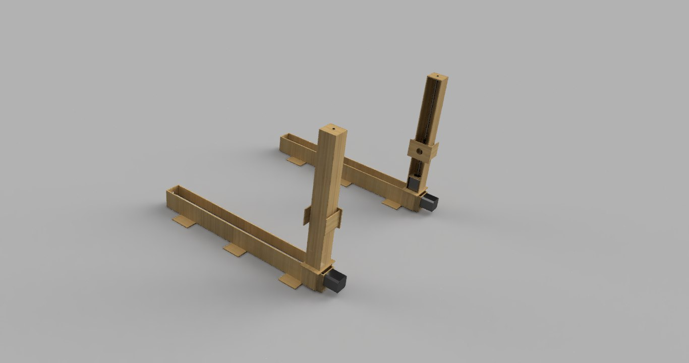

This was well and good, until we went to the shop to buy the slides. A 20 inch drawer slide can only travel 10 inches, so inorder to get 20 inches of travel we would need a slide of 40 inches, which were just too bulky and expensive for our use and the rails would protrude out of the machine for about 20 inches. Hence we dropped the plans for using drawer slides. Back to the drawing board.

We started on a new design for a more rigid maachine using smooth rods and leadscrews for motion.

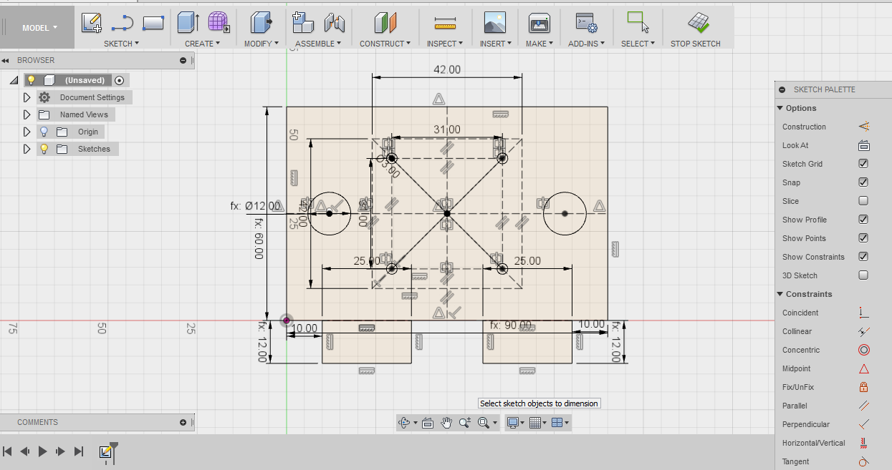

The design is fully parametric. You can change the length of each axes, the diamter of the rods and even the clearance height of the vertical axis by changing the parameters in the file. On the vertical axes there are 4 rods to provide some torsional rigidity so the towers would not bend.

This is the fully redesigned machine using 1/2 inch steel tubes, 12 mm plywood as the base and M8 lead screws to move the axes. 

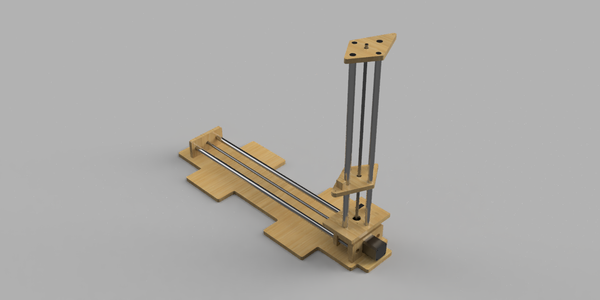

All the parts, except the lead screws were bought locally. The half inch steel tubes were not designed for linear bearings and there are not dimensionally accurate. So our plan was to 3D print a coupling for it to reduce the friction between wood and the steel.

The design made ready for milling on Shopbot (CNC mill) 

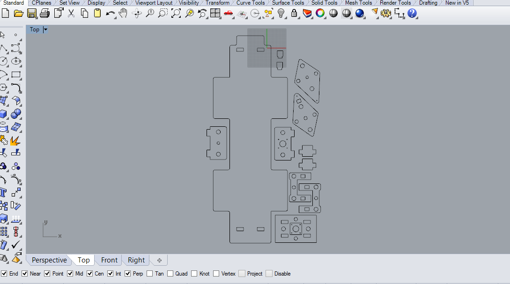

We cut the design by exporting the 2D DXF sketches and doing the CAM operations in Vcarvepro software. Since this is the intial version we decided to skip the couplers and go with wood on steel. we had to play with the tolerance between the circular hole and the steel tube to get it good enough to move on to the next step.

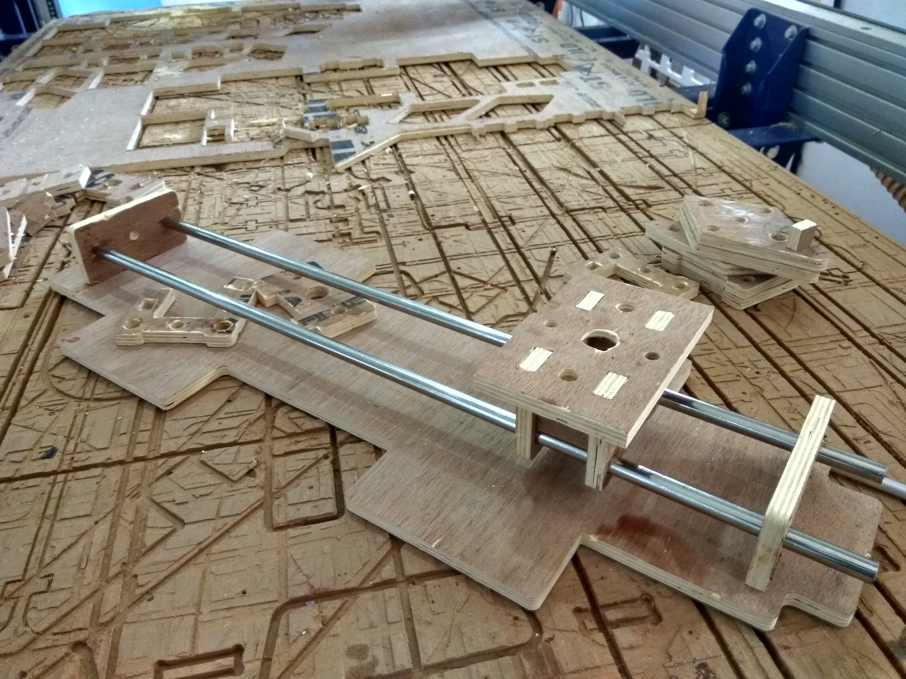

The first axis looks promising. The steel tubes are press fitted at the ends to form a rigid strucutre. The carriage is a bit loose but the motion is a lot smoother when a small amount of lubricant is applied. so we moved on to the vertical axis.

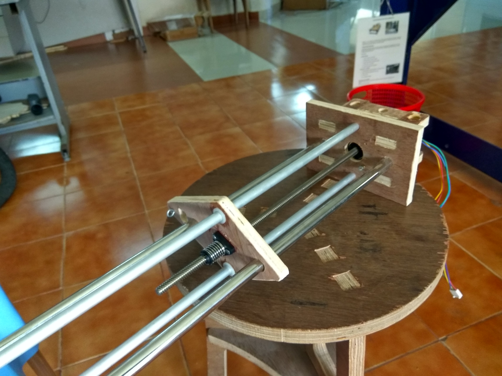

The vertical axis has two steel tubes to carry the weight and two smaller aluminum tubes to provide tortional rigidity. We are using a stepper motor with an integrated lead screw to avoid using a coupler. 

The final assembled towers. All the rods are press-fit at the ends and loose fit on the steel rods to give a smoooth motion.

**Note-** When using sliding surfaces, depending on the material, a phenomenon called **'stick and slip'** can happen. This would cause the motion to become jagged and cause vibrations. It may also lead to surfaces locking up leading to excessive loads and missed steps when using a stepper motor.  

After the machine was assembled its time for fix the machine on a table, connect all the electronics and tie the Nichrome wire across the towers.

### Connecting the Electronics

We fixed the machine on a table using clamps. The base is designed to make it easier to use clamps to hold it in place. 

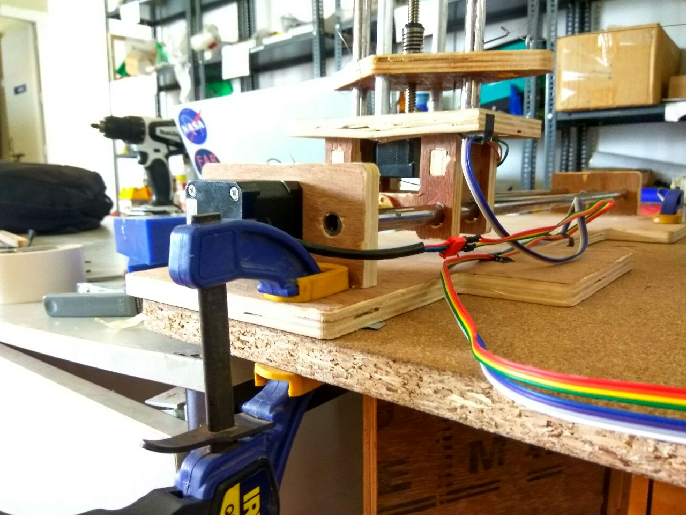

The next step is to connect the electronics to move the motors and configure the machine. We have 4 stepper motors which need to be connected to our Ramps board. The wires need to extend enough to provide enough travel of the axes.

All the wiring connects to our Ramps board, which is a CNC sheild for Arduino Mega2560. The Ramps can support upto 5 stepper motor drivers like the A4988. We are using Nema 17 motors with 200 steps per revolution running at 1/16th microstepping, giving us a smooth rotary motion.

The A4988 stepper drivers can be attached on top of the Ramps, one for each axis. Ensure **proper orientation** of the A4988 chip before attaching to the Ramps board. Each stepper can pull as much as 2 Amps, the stepper drivers have heat sinks to dissipate the heat. The board also has a 11A MOSFET on it to control the temperature of the wire connected to the D8 pin. All the components in the board will get hot, ensure proper cooling is provided. 

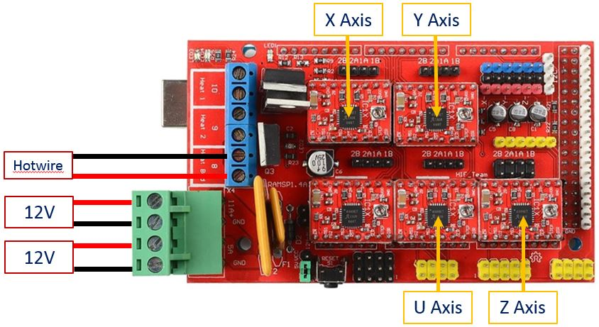

**IMPORTANT**
When the system is powered on, the stepper motors continue to draw current to maintain the holding position. The components like Stepper drivers and Mosfets can get very hot during operation. Do not operate the Ramps board without **active cooling**.

In the begining we ran our machine without active cooling and lost 4 stepper drivers and bricked an Mega2560. After that we made a base for the board, attached it using spacers and put a fan to cool the board.

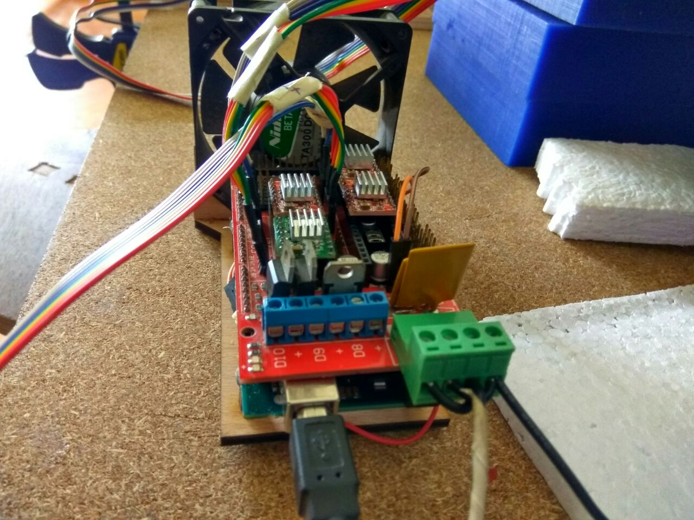

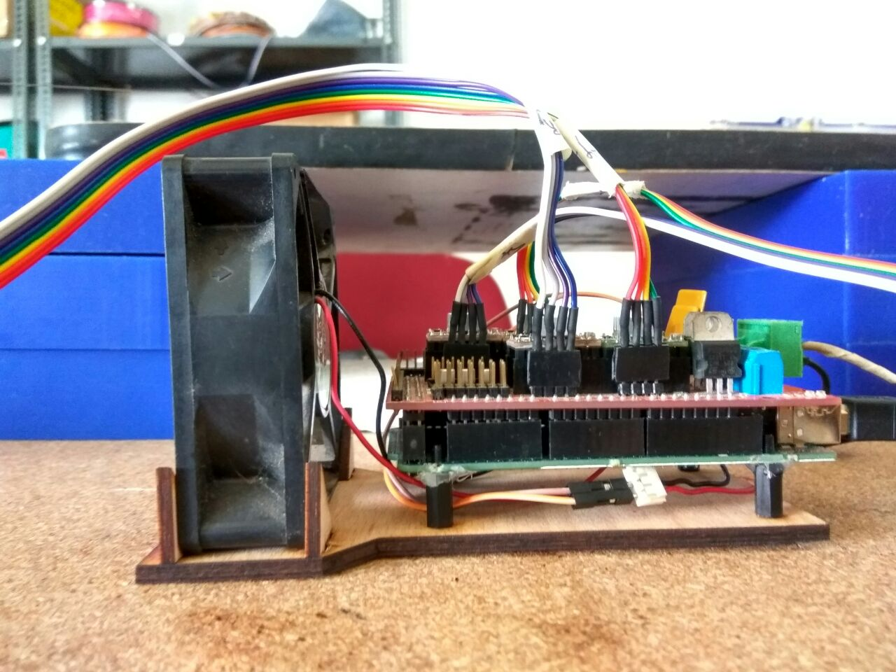

The board rests on spacers and is cooled by a 12V fan to prevent over heating of the board.

### Grbl Hotwire controller

We are using a Grbl control panel developed by [Garret Visser](http://github.com/Gerritv/Grbl-Panel/wiki) which was adapted for Hot wire cutting by Daniel Rascio.

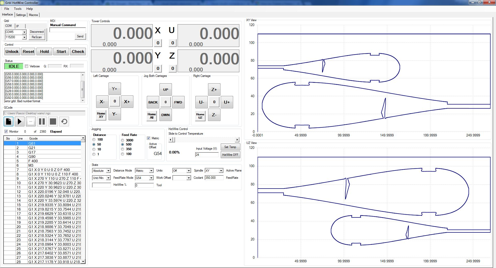

The panel has Independent jogging control for all axis, including homing along with Gcode graph visualization, and the ability to save your own macros. The Hotwire temperature can be fully controlled using M3/M5 to turn ON/OFF and S"xxx" command to set the voltage output, either manually or via scroll bar in the software. The hotwire should be connected to "D8" output and is supplied by the power connected to the "11A" input on Ramps.

### Configuring the Machine

Every CNC needs to be properlly configured before operating. Since we are using stepper motors in an open loop system (without feedback) we need to know how far the carriage will move with every revolution of the Stepper motor. This depends on the **number of steps per revolution** of the motor, the **pitch of the lead screw** and the **level of microstepping** you are using.

 **steps_per_mm = (motor_steps_per_rev * driver_microstep) / thread_pitch**

After flashing the Megaa2560 with the Grbl8c2MegaRamps file, open the serial monitor and type '$$' to access the [Grbl settings](https://github.com/grbl/grbl/wiki/Configuring-Grbl-v0.9) panel. In order to change any value type the $number=value. Eg- $0=100
Once the machine is configured, ensure that the machine moves the exact amount as shown in the controller.

### Attaching the Hotwire

In order to cut foam using a hot wire you need a resistance wire made of a suitable material which can withstand the heat and will have a uniform temperature across the length.

Nichrome is a suitable material, I have seen some use steel fishing lines. This is a good article for [selecting a Nichrome wire](https://jacobs-online.biz/wire-xformer_selection.htm) for Hotwire cutting. Since our machine will use a wire length of more than 1 meter. we decided to use a 26 guage wire. It might be a bit too thick for our application. we will also test with a 32 guage wire and see how it goes.

The next step is to attach the nichrome wire to the machine, since we have 4 independent axis, we cannot just tie both ends of the wire to the towers. The wire needs to have some extension to it, either by means of a spring or a weight attached to the end.

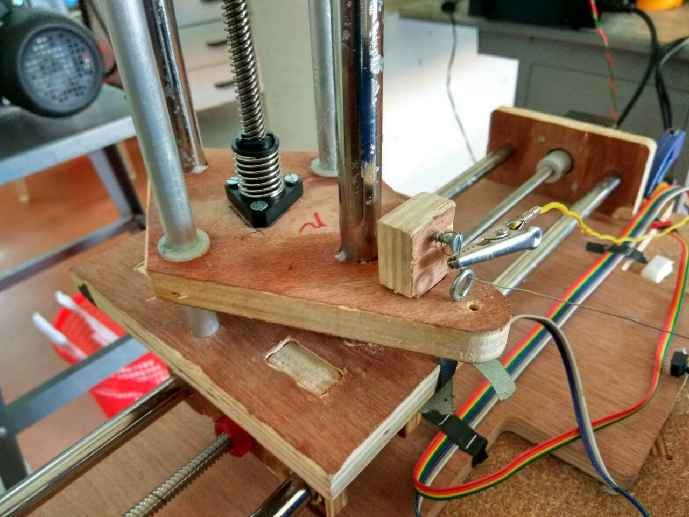

The hot wire is attached using hoops screws into the wood, these hoops help the wire move back and forth while maintaining the same height. A pulley would have been best, but we wanted to start with something simple and work our way up. In the left axis one end of the wire is attached to a screw, which is pulled up to maintain a level height at the hoop.

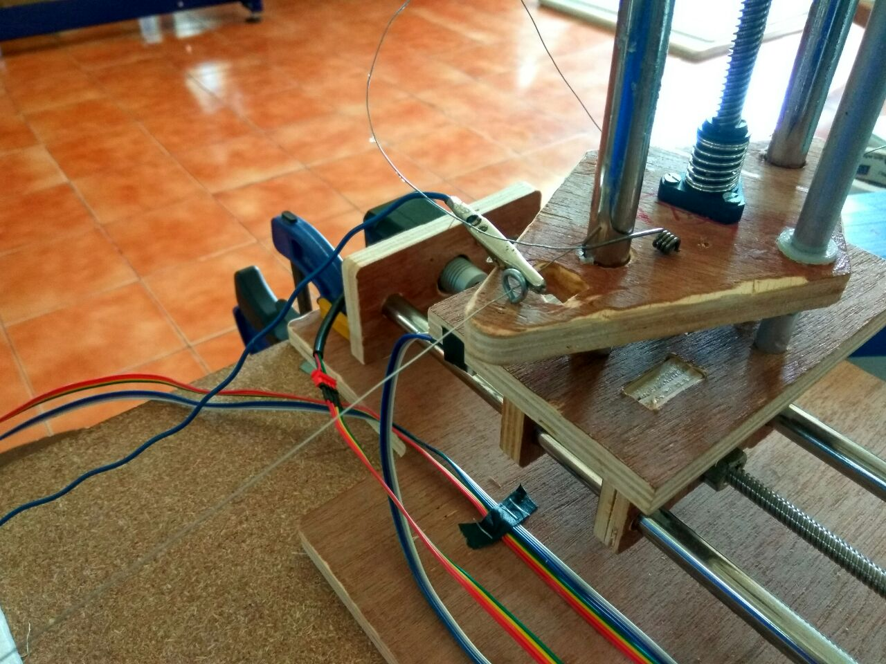

The other end of the wire is currently attached to the end of a torsion spring we had laying around, which will provide the necessary tension to keep the wire taught and to give some amount of flex so that the wire can extend and be pulled back.

### Generating the G-code

#### Wing G-code Generator

[Wing G-code Generator](https://github.com/swarfer/winggcode) is a program to generate XYUV G-code for hotwire cutting model airplan wings. It runs on python 2.7 and can also integrate with LinuxCNC's Axis interface. There is also an [online version](http://swarfer.co.za/rc/wire/index.php)

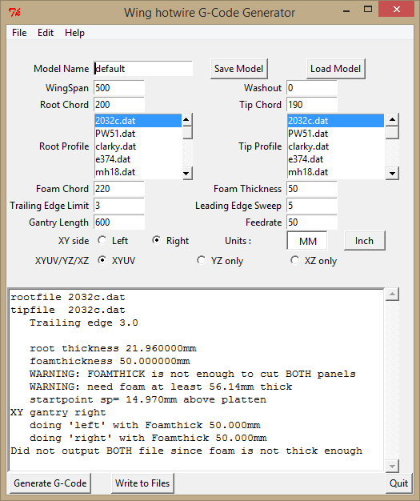

It alows you to enter the parameters of the wing such as root chord, tip chord, Sweep, gantry length and even support washout. It has a database of airfoils in **.dat** format. New airfoils can be imported in the same way.

#### Jedicut 2.4

Jedicut is a cool piece of software in that it can do both CAD/CAM and also act as a machine controller. Thought the machine controller needs a PC with the old parallel port interface. But it also has a plugin to generate the G-code. It is not the easiest to configure. Some of the options and error messages are in french, but if you sit with it for sometime, you can get it working.

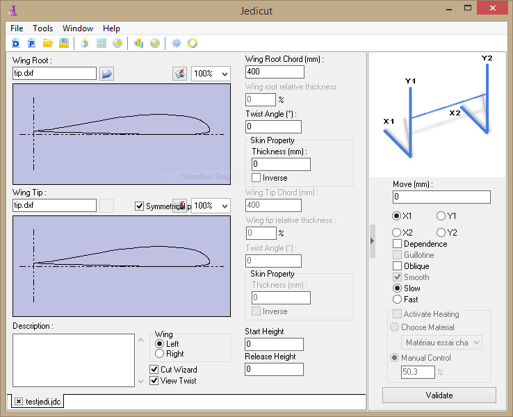

It has lots of features like cutting wizard to help you do sweept wings and compensate for wire kerf by adding a skin thickness. It can but more than wing profiles, it can cut out lettering and other shapes also.

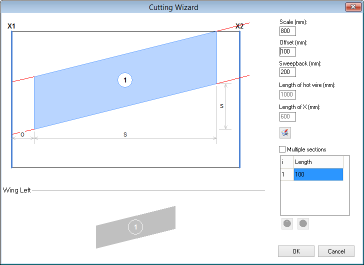

***Note-**  Wing g-code generates G-codes in Absolute mode which works on Grbl without any issues, but Jedicut generates G-code in incremental mode. We had difficulty when first getting it to work, where the machine would just move back and forth. If this happens, Edit the G-code to remove unecceasry lines in the header.*

*Both Wing G-code and Jedicut generates G-code with some Grbl unsupported codes in the header, The controller will show in the monitor when such errors happen. Edit the G-code and remove unecessary lines of code.*

### Setting the Feed rate and temperature

Unlike conventional milling, the wire cuts by melting the plastic surrounding it, and when the tool stays in one position for some length of time, the surrounding material keeps melting away. This increases the kerf of the cut and cause dimensional inaccuracies. There are two variables which affect the kerf of the cut.

1. Cutting Feed rate.
2. Temperature of wire.

The **Cutting Feed rate** is the speed with which the wire cuts throuh the material. mostly denotes in **mm/sec**. The faster the speed the lesser the kerf, but the higher the temperature required and also tension in the wire has to be sufficent to withstand the cutting forces. Good starting speeds are around 350mm/s to 500mm/s.

The **Temperature** of the wire must be a bit higher than the melting point of the foam you are cutting. Ideally you want to cut with just the **radiant heat** where by the wire dose not acually touch the material but cuts in front of it. The temperature is governed by the amount of current which flows through the wire, which is determined by its voltage. There are softwares which allow for PWM control of the wire to heat is just right at the moments to optimize the cutting feedrate.

The temperature of the wire is determined by the square of the current times the resistance.

If you are using Nichrome wire,  

[Nichrome wire Application Calculator](http://www.jacobs-online.biz/nichrome/NichromeCalc.html)   

This is a cool application that can help you determine the temperature of the wire depnding on the lenght and the voltage applied. For our setup with a wire lenght of 850mm, we applied a voltage of **26V** and cut at a feed rate of **350mm/s**. This gave us good finish and very low kerf.

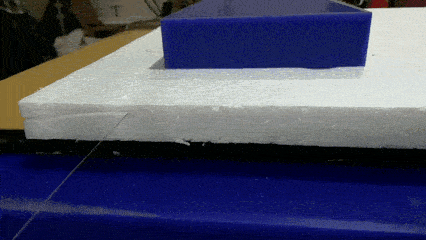

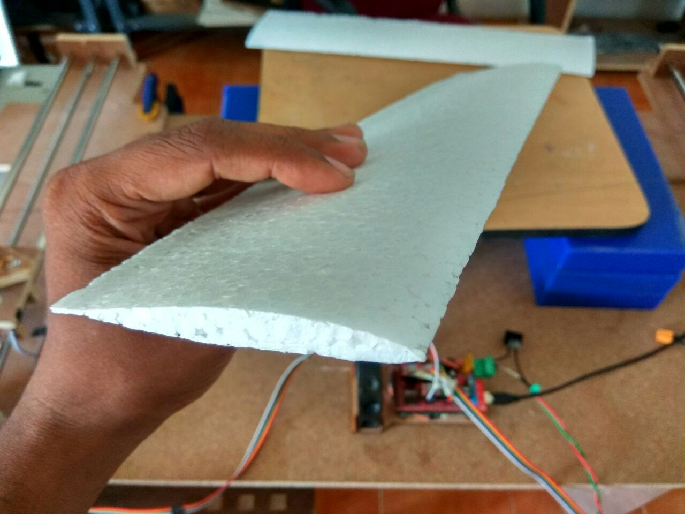

### The Cutting process

The Process starts from the design, which is exported as a dxf and turned inot G-code by one of the softwares. The machine is turned on and calibrated, the material is placed on the workbench and the origin is now set. Turn on the hot-wire, run the G-code file and watch the machine do the work for you.

**Creative Commons — Attribution-NonCommercial-ShareAlike 4.0**
